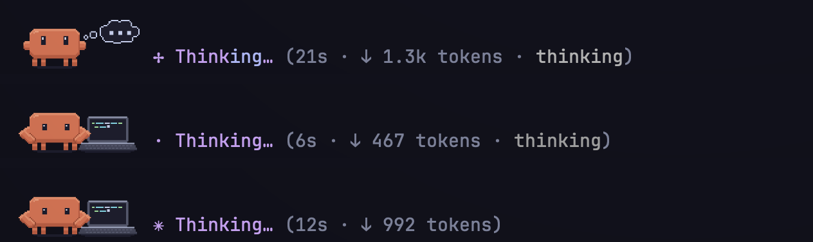
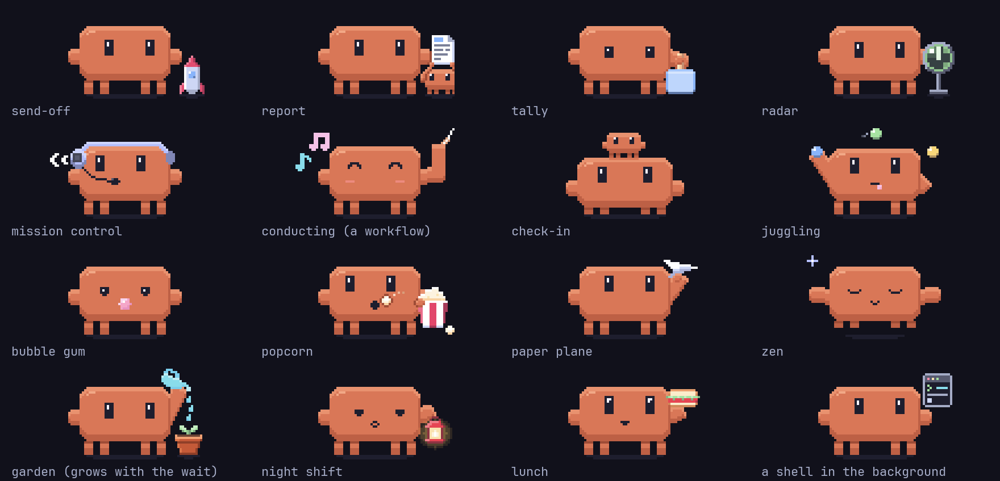
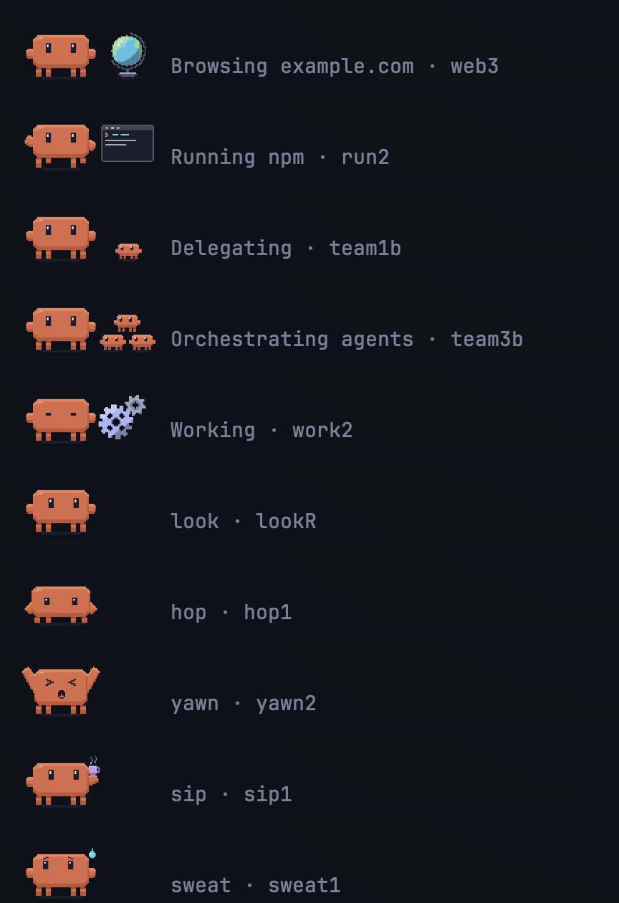

# clawdagotchi

A tiny pixel-art Claude who keeps you company in Claude Code, and the status line he lives on.


clawdagotchi is a Claude Code plugin, `mize-coworker`, that draws the Claude Code mascot in your terminal as a small orange coworker, 8 cells wide and 2 rows tall, in 132 frames of cel-shaded pixel art. He lives at the right end of the status line. While a turn runs he moves up beside the spinner and acts out what the session is doing. Between turns he breathes, blinks, wanders a few cells and, if you leave him long enough, naps. While agents or a workflow run in the background he minds them, with a short skit every few seconds. He keeps an eye on the session too: he sweats when the context window fills up, and once the prompt cache goes cold he sleeps under a layer of frost.

The repo also has the status line he sits on: one row of rounded chips with a gradient context gauge, the prompt cache, your usage windows and their pace, and the git branch. It holds his cells free at the right end of the row.

The plugin only draws. Nothing it does reaches the model, and it never changes a tool call.

[](docs/media/loops-still.png)

*Every loop at the speed he plays it, except the two sleeps, which run three times faster here. Click for a still; [loops-sheet.png](docs/media/loops-sheet.png) lays out every loop frame by frame.*

## What he does

### Beside the spinner

While a turn runs, Claude sits just left of the spinner in a small scene for what the spinner says. The spinner's word changes too: instead of a random verb, it says what is actually happening.

| The session is | The spinner says | Claude has |
|---|---|---|
| thinking | `Thinking` | a thought bubble filling with dots |
| writing its answer | `Writing` | a pen on a notepad |
| writing a tool call | `Thinking` | a laptop |
| reading a file | `Reading register.ts` | a book, its pages turning |
| editing a file | `Editing register.ts` | the laptop, a line of code growing |
| searching files | `Searching` | a magnifying glass sweeping lines of text |
| searching the web | `Searching the web` | the magnifying glass over a globe |
| fetching a page | `Browsing example.com` | a turning globe |
| running a command | `Running npm` | a small terminal printing output |
| handing work to agents | `Delegating`, `Orchestrating agents` | one to three helper Claudes, one per agent call in flight |
| waiting for you | `Asking you` | a speech bubble |
| loading a skill | `Loading a skill` | a scroll unrolling |
| calling an MCP server | `Calling <server>` | a plug going into its socket |
| using any other tool | `Working` | turning gears |

A command shows only its program name, never an argument, and a file only its basename.



*Spinner rows from a real turn: the thought bubble while the model thinks, then the laptop while it writes a tool call. Claude Code has no more specific word for that moment, so the spinner still says Thinking.*

He keeps that seat for as long as the engine draws the main spinner, through every iteration of a `/goal` as well, and drops back to the footer the moment the turn ends. Subagents' spinners are left alone.

### Between turns

Back on the status row he has a small life of his own:

- He breathes, and blinks every six seconds, half-shut on the way down and on the way up.
- Every 12 to 30 seconds he does something: strolls a few cells, looks around, hops (a crouch, the jump, a landing), yawns, or sips a coffee. The yawns come more often as his nap gets closer.
- A session opens with a wave. A turn that ends with an answer ends with a hop, or with a cheer and confetti after two minutes or more. A failed tool call gets a flinch.
- After ten idle minutes he falls asleep under a nightcap, Zs drifting up.

### While agents work

When the main session is at rest and agents or a workflow are still working in the background, he minds them. He stands as he does between turns, breathing and blinking, with a count beside him (`3 agents`) where the row has room. Every 4 to 10 seconds he plays a short skit, and never the same one twice in a row.

[](docs/media/skits-still.png)

*Each skit at the speed he plays it, then a rest. The plant grows through all four stages here; in a session it grows with the wait. Click for a still.*

| Skit | What he does |
|---|---|
| send-off | a small rocket lifts off as the agents take over from the turn |
| report | a helper runs in with a page when an agent finishes with an answer |
| tally | he holds up a paddle with how many agents are at work, up to `9+` |
| radar | he watches them on a scope |
| mission control | a headset, a word into the mic, a green check |
| conducting | a baton and drifting notes, while a workflow runs |
| check-in | a helper stands on his head |
| juggling, bubble gum, popcorn, a paper plane, zen | he passes the time; the plane comes back |
| garden | he waters a potted plant that grows with the wait: leaves after 2 minutes, a bud after 6, a flower after 15 |
| night shift, lunch | a lantern from 22:00 to 06:00 and a sandwich from 12:00 to 13:00 (the `seasonal` option) |

A shell running in the background is not an agent: he idles as usual, with a glance at a small terminal now and then. He stops minding the agents when the session says none is left, or after ten quiet minutes, and then he naps as usual.

### Reacting to the session

The status line measures the session on every refresh and leaves the numbers in a small `.vitals` file, which Claude reads while idle, at most once every ten seconds.

- From 80% context he sweats and glances at the gauge.
- While a usage window is over pace or spent, he holds an hourglass, its sand running.
- Once the prompt cache has gone cold, he sleeps frosted, a snowflake turning above him.

The sweat and the hourglass take about one idle move in three while they apply. So does the season: from 24 to 31 October he sits by a glowing jack-o'-lantern (the `seasonal` option).

### The demo

Type `/coworker demo` at the prompt and he runs through every scene, every move and every skit, about two minutes in all, in the band above the prompt. Each step is labeled with its spinner word or move and the frame on screen, like `Writing · write2`. Type it again to stop; starting a turn or `/coworker off` stops it too.



*Ten steps of `/coworker demo`, each a row of the band above the prompt.*

## The status line

`statusline/statusline.sh` draws one row and never wraps. In Ghostty each group is a rounded chip; in other terminals the groups sit flat between `│` rails. Set `STATUSLINE_STYLE` to `chips` or `flat` to force either look. From left to right:

- an orange `✻`, the model and its effort
- the context gauge: ten `▬` cells filling with a gradient, blue to lavender to mauve, warming to yellow, peach and red as the window fills, the last cell blended by how full it is; then the percent and the window size (`39% 1M`, or `390k/1M` where there is room)
- the prompt cache: minutes until it goes cold, or `cold`
- the 5-hour and 7-day usage windows, with `↗` when one is on pace to run dry before it resets, and countdowns to the resets
- the other account's numbers, when you use a second account
- the directory, the branch glyph and the branch, with dirty, ahead and behind counts
- segments other plugins publish on the status bus, warnings in yellow and failures in red
- the session's cost

As the terminal narrows, pieces drop in a fixed order. The context gauge and the countdown to the 5-hour reset outlast every other detail: the week's countdown, the other account, the dirty counts, the `✻` and the effort all go first, and in a row too short for both the gauge goes and the countdown stays. The colors are Catppuccin Mocha.

The line does two jobs for Claude. From a session's very first render it keeps his cells free at the right end of the row (the `.reserve` and `.reserve-default` files), and it writes the `.vitals` file he reacts to.


*`statusline/samples.sh` in Ghostty: the chip look at 95 and 150 columns. The dots are Claude's cells, which the line must not reach. Run it yourself to see the flat look and the gauge from 1% to 100% as well.*

## Install

You need:

- Claude Code 2.1.288 or later, for function-hook plugins and the `Image` element
- Ghostty, or another terminal that speaks the kitty graphics protocol, for the pictures (anywhere else he is drawn in braille)
- `jq` and bash 3.2 or later, for the status line

It has been tested on macOS.

### The plugin

```sh
claude plugin marketplace add TheMizeGuy/clawdagotchi
claude plugin install mize-coworker@clawdagotchi
```

Then run `/reload-plugins` in an open session, or restart Claude Code.

### The status line

Claude works with any status line, or none. Only this one keeps his cells free, though: next to another status line that fills the width, Claude Code may wrap him onto a row of his own. To install it:

```sh
git clone https://github.com/TheMizeGuy/clawdagotchi.git
cp clawdagotchi/statusline/statusline.sh ~/.claude/statusline.sh
chmod +x ~/.claude/statusline.sh
```

Then point Claude Code at it in `~/.claude/settings.json` (this replaces any status line you already have):

```json
{
  "statusLine": {
    "type": "command",
    "command": "~/.claude/statusline.sh",
    "padding": 0,
    "refreshInterval": 10
  }
}
```

## Options

Change them in `/config`, or under `pluginConfigs` in your settings. All of them are on by default.

| Option | What it does |
|---|---|
| `sprite` | Shows Claude. Off, nothing of him is drawn anywhere, the demo included. |
| `picture` | Draws him as the orange pixel-art picture. Off, he is orange braille text. |
| `big` | Makes the picture 8 cells by 2 rows. Off, it is 4 cells by 1 row with no scenes, for a terminal where the two-row picture does not sit well. |
| `besideSpinner` | Moves him beside the spinner while a turn runs. |
| `scenes` | Gives him a prop for every spinner word. Off, he sits beside the spinner alone. |
| `narrate` | Makes the spinner's word say what is happening. Off, the spinner keeps Claude Code's own verbs. |
| `animate` | Animates him. Off (reduced motion), he shows the first frame of each activity and no animation timer runs. |
| `gestures` | The wave, the hop or cheer, the flinch, the idle moves, and the skits while agents work. |
| `seasonal` | The jack-o'-lantern from 24 to 31 October, the lantern at night and the sandwich at noon (needs `gestures`). |

And the command:

| Command | What it does |
|---|---|
| `/coworker` | Shows the switches and what Claude is doing. |
| `/coworker off` | Turns Claude and the spinner words off for this session. |
| `/coworker on` | Turns them back on. |
| `/coworker demo` | Plays the tour in the band above the prompt, or stops it. |

`off`, `on` and `demo` work only when you type them at the prompt, so nothing else (the model included) can flip them.

## How it works

The plugin is a set of function hooks, a "mod" in Claude Code's terms, drawing into three of the engine's render sites:

- **`SessionMode`**, the right end of the footer, on the status line's row. Claude idles here as an `Image` of 8 by 2 cells. Its second row lies over the short permission-mode row, which Claude Code leaves empty at its right end.
- **`Spinner`**, the main session's spinner. The hook rewrites the word and, while a turn runs, draws Claude's scene with the engine's own spinner drawing placed beside it, so the whole line, elapsed time and token count included, stays intact to his right.
- **`AbovePrompt`**, the band above the prompt, for the demo.

Where the terminal speaks the kitty graphics protocol, each frame is a PNG; anywhere else, the engine draws the frame's braille `alt` text in its place. What Claude acts out comes from the turn events and the classic tool events (PreToolUse, PostToolUse, PostToolUseFailure, PermissionRequest and PermissionDenied), which fire for the main session and its agents alike. Whether agents are still at work comes from the stop hooks' list of background tasks, read by task type alone. There is no `tool.call` hook (rule 7a in `docs/BUILD-SPEC.md` says why), and no tool call is ever touched.

### The status bus

The plugin and the status line talk through small files under `~/.claude/state/statusline/bus/`. The contract is `shared/statusline-bus.ts`, vendored into the plugin as `hooks/lib/statusline-bus.ts`.

| File | Written by | Holds |
|---|---|---|
| `<session>/.reserve` | the plugin | how many cells to keep free at the row's right end: 22, or 11 below 110 columns (18 and 9 with `big` or `picture` off) |
| `.reserve-default` | the plugin | the same line, held for a session that has not reserved its cells yet |
| `<session>/.vitals` | the status line | the context percent, the state of both usage windows, and the cache |
| `<session>/<publisher>` | any plugin | one segment for the status line: a level (`info`, `warn` or `fail`) and a short text |

The status line deletes bus files that have gone three days untouched.

### The frames

`plugins/mize-coworker/scripts/frames.json` is the frame contract: 132 frames, 94 of them solo (70x40 logical pixels, drawn in 8x2 cells) and 38 scenes (105x40, drawn in 12x2 cells, Claude on the left and a prop on the right). `scripts/make-frames.py` draws them all with Pillow, from one parametric renderer for Claude and one function per prop, and exports them at 4x as hard pixels, so the terminal's scaling keeps the edges crisp. `hooks/lib/sprite.ts` mirrors the table, and `tests/test_frames.py` holds the two equal and checks every PNG's size.


*All 132 frames at the size the terminal draws them.*

### Further reading

- [`plugins/mize-coworker/README.md`](plugins/mize-coworker/README.md) is the full reference: every loop and its timing, the reserve sums, each hook, and every known limit.
- [`docs/coworker.md`](docs/coworker.md) holds the design notes, including what live sessions showed about the engine's render sites.
- [`docs/BUILD-SPEC.md`](docs/BUILD-SPEC.md) lists the conventions the plugin follows, from the platform's hard rules to the tests.
- [`CHANGELOG.md`](CHANGELOG.md) tells how he grew, version by version.

## Development

`scripts/check-all.sh` runs everything: the vendored-copy check, both status line suites, and for the plugin `claude plugin validate --strict`, a check that no `tool.call` hook can match Bash, the frame contract, and `claude plugin test`. It runs `claude` from `~/.local/bin/claude`; set `CLAUDE_BIN` to use another.

The pieces on their own:

| Command | What it does |
|---|---|
| `claude plugin test plugins/mize-coworker` | runs the plugin's 190 tests |
| `python3 -m unittest discover -s plugins/mize-coworker/tests -p 'test_*.py'` | checks the frame contract (standard library only) |
| `bash statusline/tests/test-statusline.sh` | runs the status line's 452 rendering checks, under the first `bash` on your PATH and under `/bin/bash` |
| `bash statusline/tests/test-statusline-usage-cache.sh` | runs the 24 checks of the shared usage cache |
| `bash statusline/samples.sh` | prints a gallery of the status line's looks |
| `python3 plugins/mize-coworker/scripts/make-frames.py --sheet <dir>` | redraws the frames and writes contact sheets to `<dir>` (needs Pillow) |
| `scripts/vendor-shared.sh` | copies `shared/statusline-bus.ts` into the plugin; with `--check`, fails on drift |
| `scripts/tui-capture.py` | drives a real session in a pseudo-terminal and saves its screen as text and PNG |

Edit `shared/statusline-bus.ts`, never its vendored copy. `tui-capture.py` sees the braille `alt` rather than the pictures, since a pseudo-terminal has no graphics protocol; its header explains the setup. The pictures themselves were checked in Ghostty, with `screencapture`.

## Limits

- A terminal without the kitty graphics protocol (Terminal.app, VS Code's terminal) shows each frame's braille `alt`, dim, in one of twelve poses, so the props do not show. Set `picture` to false there for orange braille.
- The two-row picture spans the permission-mode row under the status line, which Claude Code 2.1.288 leaves empty at its right end. If a later version fills that space, set `big` to false.
- The status line is tuned for Catppuccin Mocha on a dark background.
- Nothing is drawn under `claude -p` or the SDK.

## Credits and license

Built by TheMizeGuy with Claude Code.

Claude and its mascot are Anthropic's. This is an unofficial, independent project, not affiliated with or endorsed by Anthropic.

MIT licensed; see [LICENSE](LICENSE).
